## Realisation
Travaux réalisés

# Project Web Application 

* Backend:NodeJs 
* Frontend: PUG + CSS

  # Logo : 

    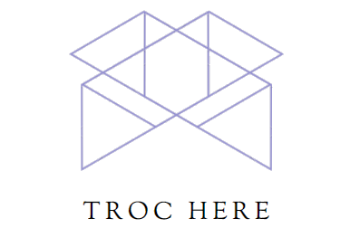

  # Login Page :

  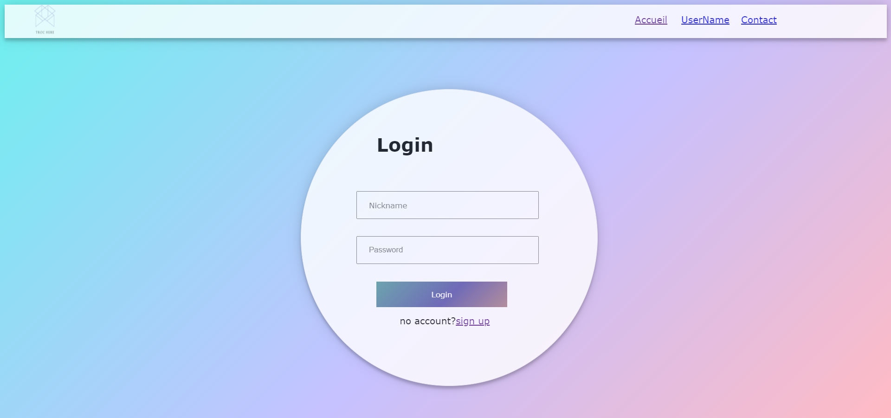

  # Register Page :

  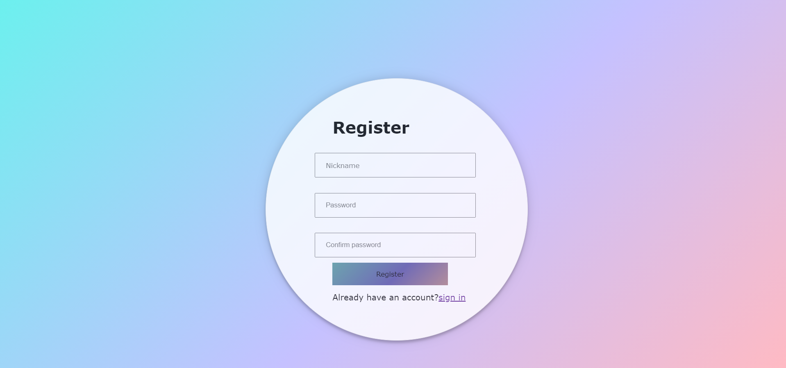

  # User Account Page :
  
  
  # User Account Page :
  

# Project Web (Spring, VueJs, Thymeleaf, HTML, CSS, MYSQL)

  # Logo : 

  

  # Home Page :

  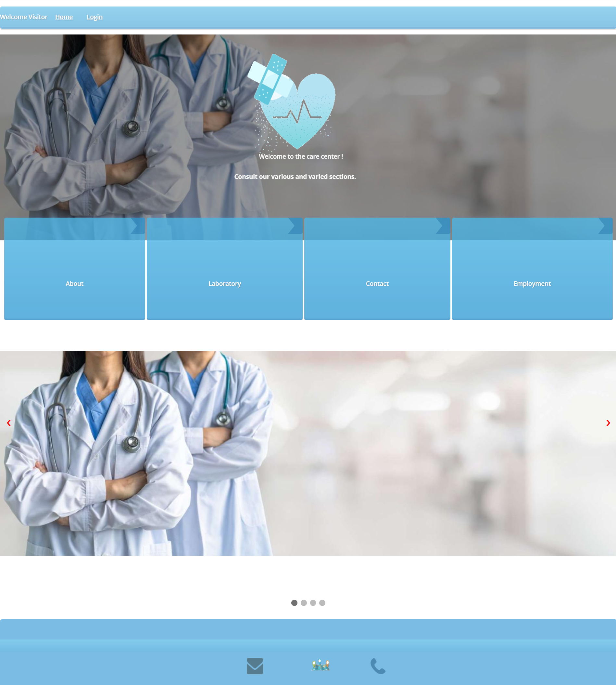

  # Login Page :

  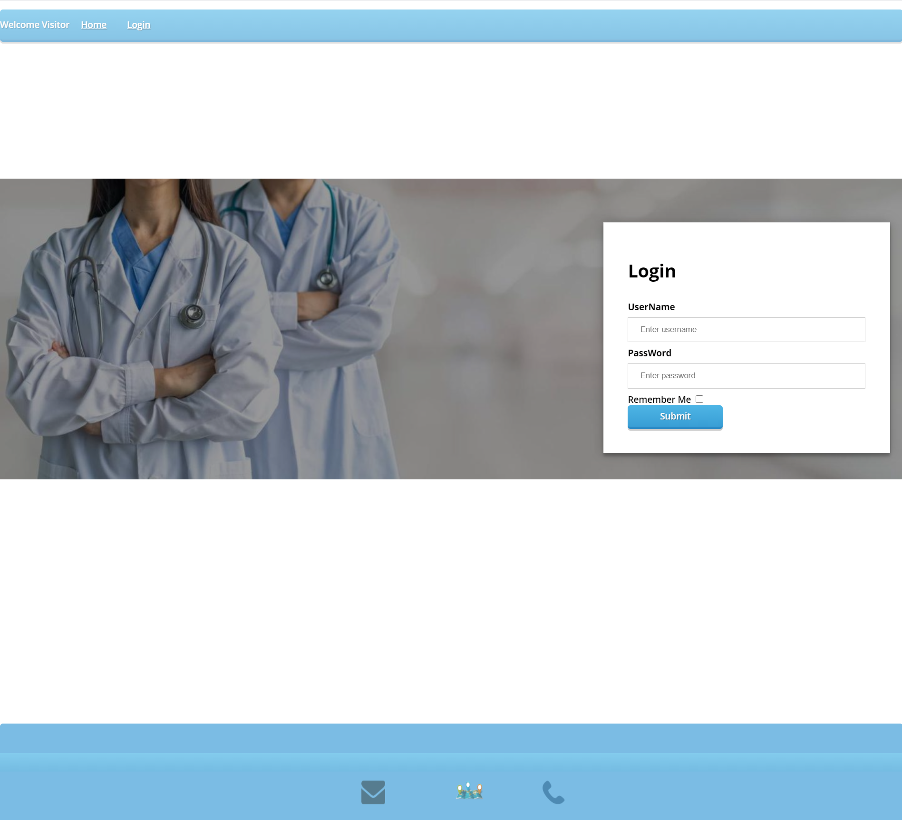

  # User Account Page :

  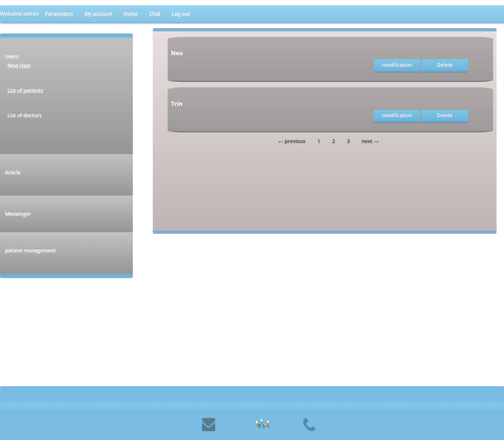

  # Account Settings Page :
  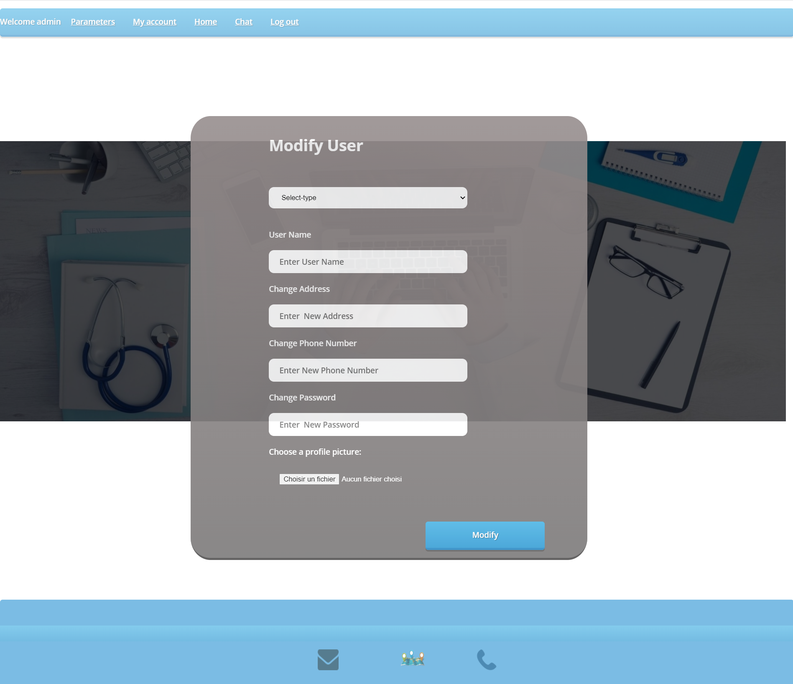
  
  # Project Decision Support System (BI) 
  
  # User Form:

  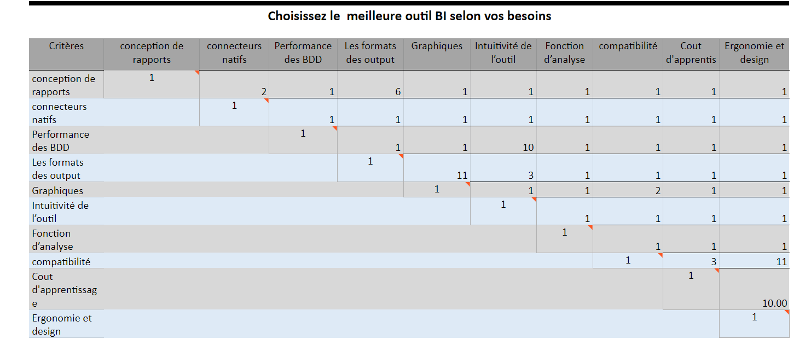

  # comparison criterion for BI Tools:

  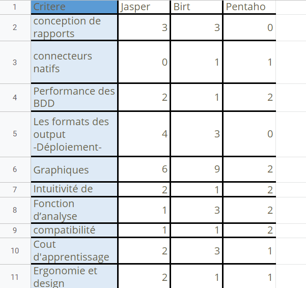

  # comparison matrix:
  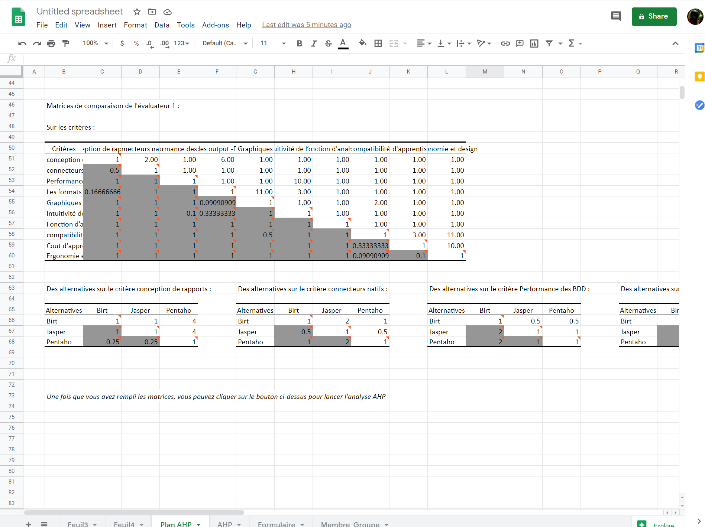
  
  # comparison graph:
  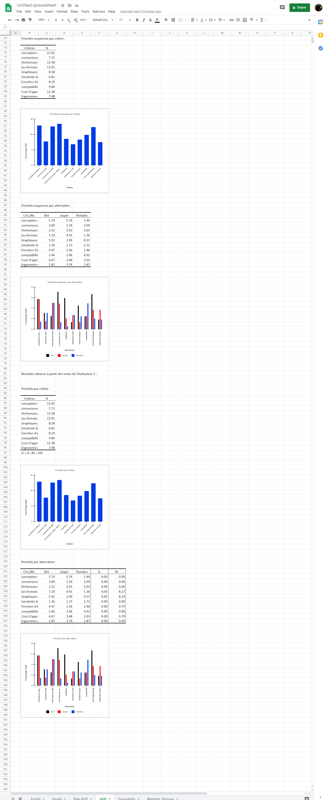
  
  # Comming Project mobile application (React native)
  
