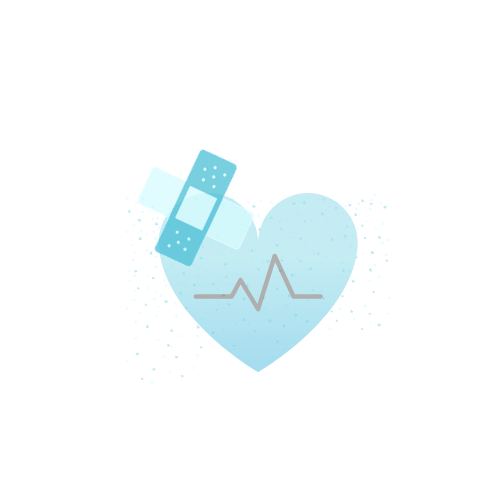
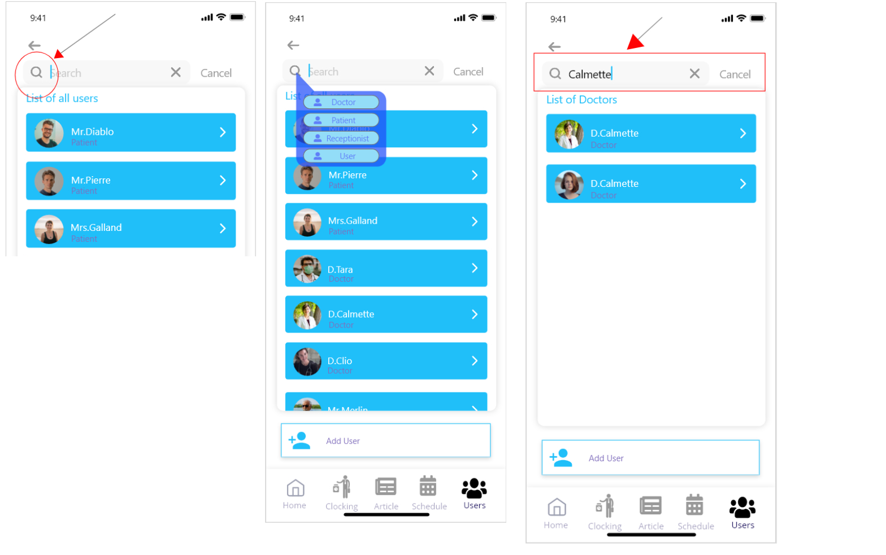
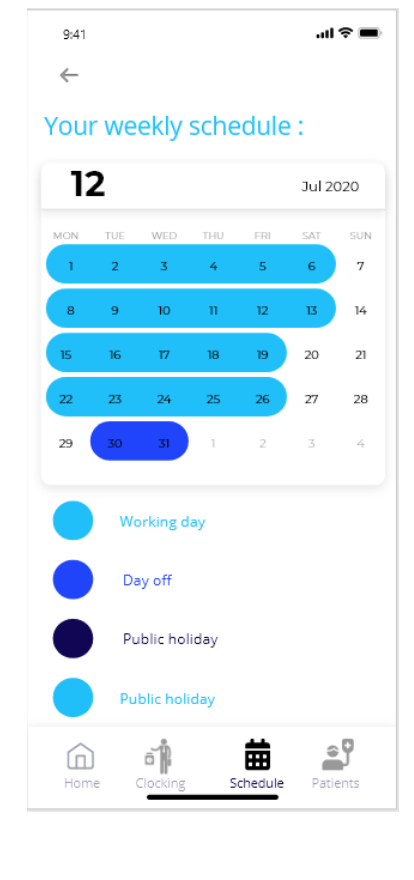
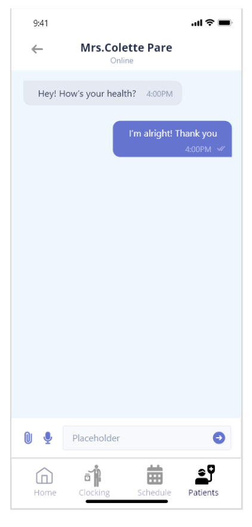
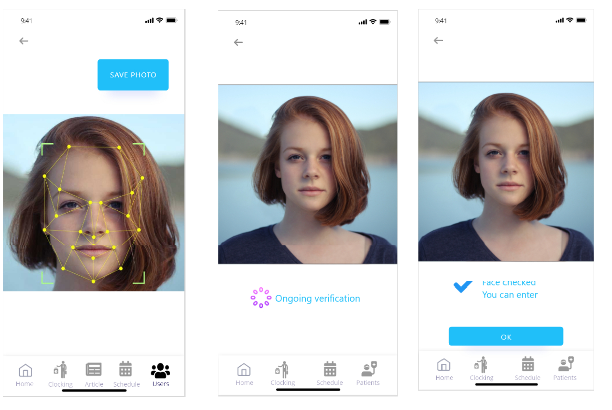

## Realisation
Travaux réalisés

# Project Web Application 

* Backend:NodeJs 
* Frontend: PUG + CSS

  # Logo : 

    

  # Login Page :

  

  # Register Page :

  

  # User Account Page :
  
  
  
  # Message sending form:
  
  
  
# Project Web Application for Movies and series manager 

* Backend:NodeJs 
* Frontend: HTML + CSS
 # Home Page :

  
  
# Adding Film or serie Form :

  
  
  # Film Details Page :

  

  # Serie Details Page :
  
  

# Project Web (Spring, VueJs, Thymeleaf, HTML, CSS, MYSQL)

  # Logo : 

  

  # Home Page :

  

  # Login Page :

  

  # User Account Page :

  

  # Account Settings Page :
  
  
  # Project Decision Support System (BI) 
  
  # User Form:

  

  # comparison criterion for BI Tools:

  

  # comparison matrix:
  
  
  # comparison graph:
  
  
 # Comming Project mobile application (React native) HealDroid
  
   # Logo Entreprise: 

   

   # Logo HealDroid: 

   
   
   # Prototype d'interfaces graphiques: 
   
   # Home Page:
   
   
  # Authentification interfaces:
   
   
   # Clocking interfaces:
   
   
   # Research interfaces:
   
   
   # Appointment Page:
   
   
   # Message sending Page:
   
   
   # Doctor Options:
   
   
   # Patient Page:
   
   
   # facial recognition interfaces:
   
